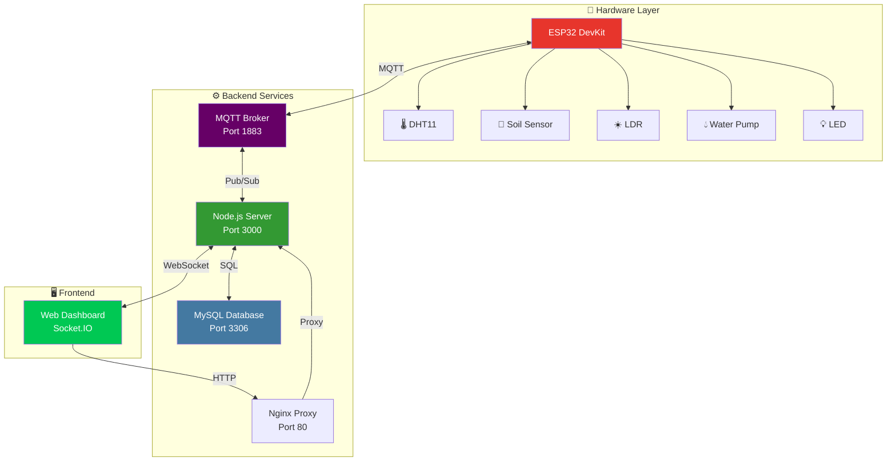

# 🌱 IoT Smart Irrigation System

<div align="center">


**An automated irrigation monitoring and control system using ESP32, environmental sensors, and real-time web interface**

[📖 Documentation](#-documentation) • [🚀 Installation](#-quick-installation) • [🏗️ Architecture](#️-system-architecture) • [📸 Demo](#-demo)

</div>

---

## 📑 Table of Contents

- [✨ Features](#-features)
- [🏗️ System Architecture](#️-system-architecture)
- [📁 Project Structure](#-project-structure)
- [🔧 System Requirements](#-system-requirements)
- [🚀 Quick Installation](#-quick-installation)
- [📦 Detailed Installation](#-detailed-installation)
- [🎮 Usage](#-usage)
- [🔌 API Endpoints](#-api-endpoints)
- [📊 Database Schema](#-database-schema)
- [🛠️ Troubleshooting](#️-troubleshooting)
- [📸 Demo](#-demo)
- [🤝 Contributing](#-contributing)
- [📄 License](#-license)

---

## ✨ Features

### 🌡️ Real-time Environmental Monitoring

- **Temperature & Humidity**: DHT11 sensor
- **Soil Moisture**: Analog soil moisture sensor
- **Light Intensity**: LDR module (digital output)
- **Live Updates**: Socket.IO real-time communication

### 💧 Smart Control

- **Manual Mode**: Remote control of water pump and LED
- **Auto Mode**: Irrigation based on soil moisture threshold
- **Speed Control**: PWM 0-255 pump speed adjustment
- **Custom Threshold**: Configurable ON/OFF conditions

### 📊 Dashboard & Reports

- **Responsive Web UI**: Gauge charts visualization
- **Historical Data**: MySQL database storage
- **Device Status**: Real-time status monitoring
- **User Authentication**: Login/Register system

### 🔐 Security & Management

- **Password Encryption**: bcrypt hashing
- **Session Management**: Express sessions
- **MQTT Authentication**: Secure broker connection
- **Reverse Proxy**: Nginx configuration

---

## 🏗️ System Architecture



### 🔄 Data Flow

1. **ESP32** reads sensor data every 3 seconds
2. **Publishes** JSON via MQTT topic `esp32/dht11`
3. **Node.js server** subscribes and saves to MySQL
4. **Socket.IO** broadcasts to all connected clients
5. **Web Dashboard** displays real-time data with gauge charts
6. **User actions** → HTTP API → MQTT → ESP32 execution

---

## 📁 Project Structure

```
📦 IoT-Smart-Irrigation-System
├── 📂 server-nodejs/              # Node.js Backend
│   ├── 📄 server.js               # Main server file
│   ├── 📄 config.js               # System configuration
│   ├── 📄 views.js                # HTML templates
│   └── 📄 package.json            # Dependencies
│
├── 📂 hardware/                   # ESP32 Firmware
│   ├── 📄 esp32IoT.ino            # Main Arduino sketch
│   └── 📄 configWeb.h             # WiFi/MQTT web config
│
├── 📂 database/                   # Database Setup
│   ├── 📄 docker-compose.yml      # MySQL + phpMyAdmin
│   └── 📄 schema.sql              # Database structure
│
├── 📂 mqtt-broker/                # MQTT Configuration
│   └── 📄 mosquitto.conf          # Broker settings
│
├── 📂 nginx/                      # Reverse Proxy
│   └── 📄 iot.conf                # Nginx configuration
│
├── 📂 docs/                       # Documentation
│   ├── 📄 API.md                  # API documentation
│   ├── 📄 WIRING.md               # Hardware wiring guide
│   └── 📸 screenshots/            # System screenshots
│
├── 📄 .gitignore                  # Git ignore rules
├── 📄 README.md                   # This file
└── 📄 LICENSE                     # MIT License
```

---

## 🔧 System Requirements

### 💻 Software

| Technology | Version | Purpose |
|------------|---------|---------|
|  | 18.x+ | Backend server |
|  | 8.0+ | Database |
|  | 20.x+ | Container (optional) |
|  | 2.x+ | MQTT Broker |
|  | 2.x+ | ESP32 firmware |

### 🔌 Hardware

| Component | Quantity | Description |
|-----------|----------|-------------|
| ESP32 DevKit | 1 | Main microcontroller |
| DHT11 | 1 | Temperature/Humidity sensor |
| Soil Moisture | 1 | Soil moisture sensor (Analog) |
| LDR Module | 1 | Light sensor (Digital) |
| L298N | 1 | Motor driver |
| Water Pump | 1 | 5-12V water pump |
| LED | 1 | Built-in LED |
| Breadboard | 1 | Prototyping board |
| Jumper Wires | 20+ | Connection wires |

---

## 🚀 Quick Installation

### 📋 Summary

```bash
# 1. Clone repository
git clone https://github.com/yourusername/IoT-Smart-Irrigation.git
cd IoT-Smart-Irrigation

# 2. Install Backend
cd server-nodejs
npm install
node server.js

# 3. Run Database (Docker)
cd ../database
docker-compose up -d

# 4. Configure MQTT Broker
sudo nano /etc/mosquitto/mosquitto.conf
sudo systemctl restart mosquitto

# 5. Flash ESP32 firmware
# Open Arduino IDE → Upload hardware/esp32IoT.ino
```

---

## 📦 Detailed Installation

### 1️⃣ Backend Setup (Node.js Server)

#### Step 1: Clone Repository

```bash
git clone https://github.com/yourusername/IoT-Smart-Irrigation.git
cd IoT-Smart-Irrigation/server-nodejs
```

#### Step 2: Install Dependencies

```bash
npm install
```

**Main packages:**
- `express` - Web framework
- `mqtt` - MQTT client
- `mysql2` - MySQL driver
- `socket.io` - Real-time communication
- `bcrypt` - Password hashing
- `express-session` - Session management

#### Step 3: Configuration

Edit `config.js`:

```javascript
module.exports = {
    server: {
        port: 3000,
        host: '0.0.0.0'
    },
    database: {
        host: '192.168.1.238',  // ⚠️ Change to your IP
        user: 'root',
        password: 'your_password',  // ⚠️ Change password
        database: 'du_an_IoT2025'
    },
    mqtt: {
        server: 'mqtt://192.168.1.238',  // ⚠️ Change to your IP
        username: 'serverBroker',
        password: 'your_mqtt_password',  // ⚠️ Change password
        topics: {
            sensor: 'esp32/dht11',
            led_control: 'esp32/led/state',
            // ... other topics
        }
    }
};
```

#### Step 4: Run Server

```bash
node server.js
```

**Expected output:**
```
✅ Database connected successfully!
✅ MQTT Broker connected!
📡 Listening: esp32/dht11
========================================
🚀 Server running at: http://localhost:3000
🌐 Access: http://192.168.1.238:3000
```

---

### 2️⃣ Database Setup (MySQL + phpMyAdmin)

#### Method 1: Using Docker (Recommended)

```bash
cd database
docker-compose up -d
```

**Check containers:**
```bash
docker ps
```

**Access phpMyAdmin:**
- URL: http://localhost:8888
- Username: `root`
- Password: `root14771404`

#### Method 2: Direct MySQL Installation

```bash
# Ubuntu/Debian
sudo apt update
sudo apt install mysql-server -y
sudo mysql_secure_installation

# Create database
sudo mysql -u root -p
```

**SQL Commands:**

```sql
CREATE DATABASE du_an_IoT2025;
USE du_an_IoT2025;

-- Users table
CREATE TABLE users (
    id INT AUTO_INCREMENT PRIMARY KEY,
    username VARCHAR(50) UNIQUE NOT NULL,
    password VARCHAR(255) NOT NULL,
    created_at TIMESTAMP DEFAULT CURRENT_TIMESTAMP
);

-- Sensor data table
CREATE TABLE sensor_data (
    id INT AUTO_INCREMENT PRIMARY KEY,
    temperature FLOAT,
    humidity FLOAT,
    soil_moisture FLOAT,
    light_value INT,
    timestamp TIMESTAMP DEFAULT CURRENT_TIMESTAMP
);

-- Index for faster queries
CREATE INDEX idx_timestamp ON sensor_data(timestamp);
```

---

### 3️⃣ MQTT Broker Setup (Mosquitto)

#### Step 1: Install Mosquitto

```bash
# Ubuntu/Debian
sudo apt update
sudo apt install mosquitto mosquitto-clients -y

# Verify installation
mosquitto -v
```

#### Step 2: Security Configuration

```bash
# Create password file
sudo mosquitto_passwd -c /etc/mosquitto/passwd serverBroker
# Enter password when prompted

# Add user for ESP32
sudo mosquitto_passwd /etc/mosquitto/passwd esp32Client
```

#### Step 3: Configure File

Edit `/etc/mosquitto/mosquitto.conf`:

```conf
# Persistence
persistence true
persistence_location /var/lib/mosquitto/

# Logging
log_dest file /var/log/mosquitto/mosquitto.log

# MQTT Port
listener 1883 0.0.0.0
allow_anonymous false
password_file /etc/mosquitto/passwd

# WebSocket (optional)
listener 9001
protocol websockets
```

#### Step 4: Start Service

```bash
sudo systemctl restart mosquitto
sudo systemctl enable mosquitto
sudo systemctl status mosquitto
```

**Test MQTT:**

```bash
# Terminal 1: Subscribe
mosquitto_sub -h localhost -t "test/topic" -u serverBroker -P your_password

# Terminal 2: Publish
mosquitto_pub -h localhost -t "test/topic" -m "Hello MQTT" -u serverBroker -P your_password
```

---

### 4️⃣ ESP32 Firmware Setup

#### Step 1: Prepare Arduino IDE

1. Download Arduino IDE 2.x: https://www.arduino.cc/en/software
2. Install ESP32 Board:
   - `File` → `Preferences`
   - Add URL: `https://dl.espressif.com/dl/package_esp32_index.json`
   - `Tools` → `Board Manager` → Search "ESP32" → Install

#### Step 2: Install Libraries

Go to `Tools` → `Manage Libraries`, search and install:

```
✅ DHT sensor library (by Adafruit)
✅ Adafruit Unified Sensor
✅ PubSubClient (by Nick O'Leary)
✅ ArduinoJson (by Benoit Blanchon)
```

#### Step 3: Upload Code

1. Open file `hardware/esp32IoT.ino`
2. Select board: `Tools` → `Board` → `ESP32 Dev Module`
3. Select port: `Tools` → `Port` → `COM3` (or `/dev/ttyUSB0`)
4. Click **Upload** ⬆️

#### Step 4: WiFi/MQTT Configuration

After uploading, ESP32 will create an Access Point:

```
📡 SSID: ESP32_Conf
🔑 Password: 12345678

1. Connect to this WiFi
2. Access: http://192.168.4.1
3. Enter WiFi and MQTT credentials
4. ESP32 will reboot and connect
```

---

### 5️⃣ Nginx Reverse Proxy (Optional)

#### Step 1: Install Nginx

```bash
sudo apt install nginx -y
```

#### Step 2: Configure

Create file `/etc/nginx/sites-available/iot`:

```nginx
server {
    listen 80;
    server_name iot.yourdomain.com;  # Change domain

    location / {
        proxy_pass http://127.0.0.1:3000;
        proxy_http_version 1.1;
        
        # WebSocket support
        proxy_set_header Upgrade $http_upgrade;
        proxy_set_header Connection "upgrade";
        
        proxy_set_header Host $host;
        proxy_set_header X-Real-IP $remote_addr;
        
        proxy_read_timeout 86400;
    }
}
```

#### Step 3: Enable Configuration

```bash
sudo ln -s /etc/nginx/sites-available/iot /etc/nginx/sites-enabled/
sudo nginx -t
sudo systemctl restart nginx
```

---

### 6️⃣ Hardware Wiring

#### Wiring Diagram

```
ESP32           →  Sensor/Device
━━━━━━━━━━━━━━━━━━━━━━━━━━━━━━━
GPIO 15         →  DHT11 Data
GPIO 4          →  LDR Module DO
GPIO 34         →  Soil Moisture AO
GPIO 2          →  LED (built-in)

GPIO 26         →  L298N IN1
GPIO 27         →  L298N IN2
GPIO 25         →  L298N ENA (PWM)

3.3V            →  Sensor VCC
GND             →  Sensor GND
```

**Detailed Guide:**
- [📄 WIRING.md](docs/WIRING.md) - Complete wiring instructions

---

## 🎮 Usage

### 🌐 Access Web Dashboard

1. Open browser: `http://your-server-ip:3000`
2. Register a new account
3. Login

### 📊 Main Dashboard

**Information displayed:**
- 🌡️ **Temperature**: Gauge 0-50°C
- 💧 **Humidity**: Gauge 0-100%
- 🌱 **Soil Moisture**: Gauge 0-100%
- ☀️ **Light**: 0% (Bright) / 100% (Dark)

### ⚙️ Device Control

#### 1. LED Control
```
💡 TURN ON  |  TURN OFF
```

#### 2. Water Pump - Manual Mode
```
Mode: [Manual] [Auto]

💧 PUMP ON  |  PUMP OFF

Pump Speed (PWM): ━━━○━━━ 255
```

#### 3. Water Pump - Auto Mode
```
Turn ON threshold: ━━○━━━━ 30%
Turn OFF threshold: ━━━━━━○ 80%

[Update Threshold]
```

**Auto Logic:**
- Soil moisture < 30% → Turn pump ON
- Soil moisture > 80% → Turn pump OFF

---

## 🔌 API Endpoints

### 🔐 Authentication

| Method | Endpoint | Body | Description |
|--------|----------|------|-------------|
| POST | `/login` | `username`, `password` | User login |
| POST | `/register` | `username`, `password` | User registration |
| GET | `/logout` | - | User logout |

### 💡 Device Control

| Method | Endpoint | Body | Description |
|--------|----------|------|-------------|
| GET | `/light/on` | - | Turn LED on |
| GET | `/light/off` | - | Turn LED off |
| GET | `/pump/mode/manual` | - | Manual mode |
| GET | `/pump/mode/auto` | - | Auto mode |
| GET | `/pump/manual/on` | - | Turn pump on (manual) |
| GET | `/pump/manual/off` | - | Turn pump off (manual) |
| POST | `/pump/speed` | `speed`: 0-255 | Set pump speed |
| POST | `/pump/auto/threshold` | `threshold_on`, `threshold_off` | Set auto threshold |

### 📡 MQTT Topics

| Topic | Direction | Payload | Description |
|-------|-----------|---------|-------------|
| `esp32/dht11` | ESP32 → Server | JSON | Sensor data |
| `esp32/led/state` | Server → ESP32 | ON/OFF | LED control |
| `esp32/pump/mode` | Server → ESP32 | MANUAL/AUTO | Pump mode |
| `esp32/pump/manual/state` | Server → ESP32 | ON/OFF | Pump on/off |
| `esp32/pump/speed` | Server → ESP32 | 0-255 | PWM speed |
| `esp32/pump/auto/threshold` | Server → ESP32 | JSON | Auto threshold |

**Example JSON payload:**

```json
{
  "temp": 28.5,
  "humi": 65.2,
  "soilHumi": 45.8,
  "lightVal": 1,
  "lightPercentage": 100,
  "mode": "AUTO"
}
```

---

## 📊 Database Schema

### Table: `users`

| Column | Type | Description |
|--------|------|-------------|
| `id` | INT (PK) | User ID |
| `username` | VARCHAR(50) | Username |
| `password` | VARCHAR(255) | Password (bcrypt) |
| `created_at` | TIMESTAMP | Creation date |

### Table: `sensor_data`

| Column | Type | Description |
|--------|------|-------------|
| `id` | INT (PK) | Record ID |
| `temperature` | FLOAT | Temperature (°C) |
| `humidity` | FLOAT | Air humidity (%) |
| `soil_moisture` | FLOAT | Soil moisture (%) |
| `light_value` | INT | Light (0/1) |
| `timestamp` | TIMESTAMP | Record time |

**Sample queries:**

```sql
-- Get latest 100 records
SELECT * FROM sensor_data 
ORDER BY timestamp DESC 
LIMIT 100;

-- Average temperature in 24h
SELECT AVG(temperature) as avg_temp 
FROM sensor_data 
WHERE timestamp >= NOW() - INTERVAL 24 HOUR;
```

---

## 🛠️ Troubleshooting

### ❌ Common Issues

#### 1. ESP32 WiFi Connection Failed

```
⚠️ WiFi not configured! Entering AP mode...
```

**Solution:**
- Connect to AP `ESP32_Conf`
- Access `http://192.168.4.1`
- Verify correct SSID/Password

#### 2. MQTT Connection Failed

```
❌ MQTT Error: Connection refused
```

**Solution:**

```bash
# Check if Mosquitto is running
sudo systemctl status mosquitto

# Test connection
mosquitto_sub -h localhost -t "test" -u serverBroker -P password

# Check logs
sudo tail -f /var/log/mosquitto/mosquitto.log
```

#### 3. Database Connection Error

```
❌ Database connection error: ECONNREFUSED
```

**Solution:**

```bash
# Check MySQL status
sudo systemctl status mysql

# Test connection
mysql -u root -p

# Check port
netstat -tuln | grep 3306
```

#### 4. Socket.IO Not Real-time

**Solution:**
- Check Nginx config supports WebSocket
- Add headers:

```nginx
proxy_set_header Upgrade $http_upgrade;
proxy_set_header Connection "upgrade";
```

#### 5. Sensor Reading Errors

**DHT11 returns NaN:**

```cpp
// Add delay before reading
delay(2000);
float h = dht.readHumidity();
float t = dht.readTemperature();
```

**Soil Sensor wrong values:**

```cpp
// Calibrate mapping
int soilRaw = analogRead(SOIL_MOISTURE_AO);
// Check values when completely dry/wet
float soilHumi = map(soilRaw, 4095, 1500, 0, 100);
```

---

## 📸 Demo

### 🎥 Video Demo

Video Demo
### 🖼️ Screenshots

<table>
  <tr>
    <td><br/><b>Login Page</b></td>
    <td><br/><b>Dashboard</b></td>
  </tr>
  <tr>
    <td><br/><b>Control Panel</b></td>
    <td><br/><b>Hardware Setup</b></td>
  </tr>
</table>

---

## 🤝 Contributing

We welcome all contributions! 🎉

### 📝 How to Contribute

1. Fork the repository
2. Create feature branch (`git checkout -b feature/AmazingFeature`)
3. Commit changes (`git commit -m 'Add some AmazingFeature'`)
4. Push to branch (`git push origin feature/AmazingFeature`)
5. Create Pull Request

### 🐛 Report Bugs

Open an Issue with:
- Detailed bug description
- Steps to reproduce
- Screenshots (if applicable)
- Environment info (OS, Node version, etc.)


## 📞 Contact

**Nguyen Hoai Duc**

- 📧 Email: your.email@example.com
- 💼 LinkedIn: https://www.linkedin.com/in/duc-nguyen-hoai/
- 🐙 GitHub: https://github.com/h-ducnguyen

---

<div align="center">

**⭐ If you find this project helpful, please give it a star!**

Made with ❤️ by [Nguyen Hoai Duc](https://github.com/h-ducnguyen)

</div>